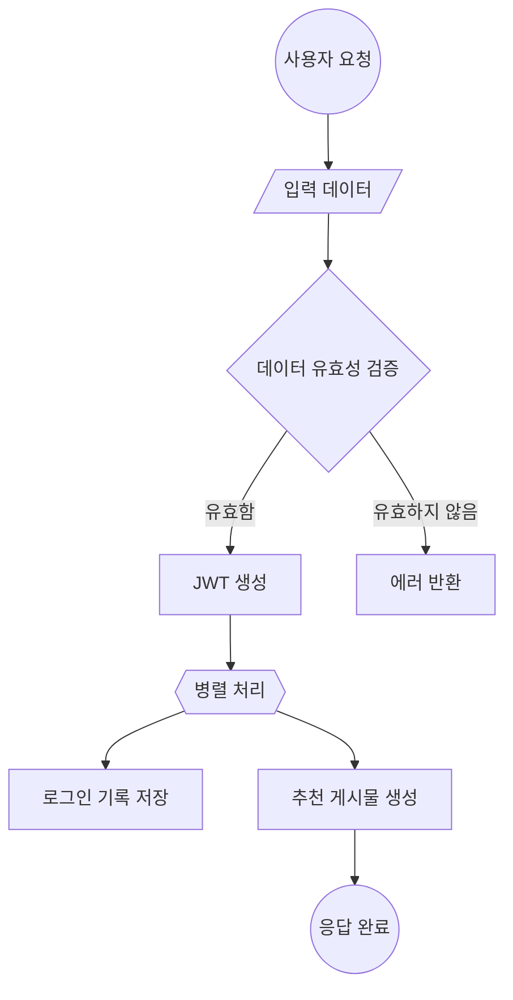
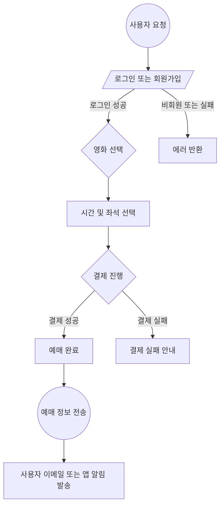
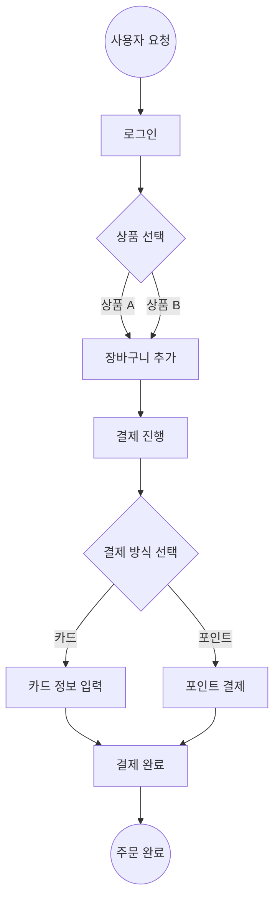
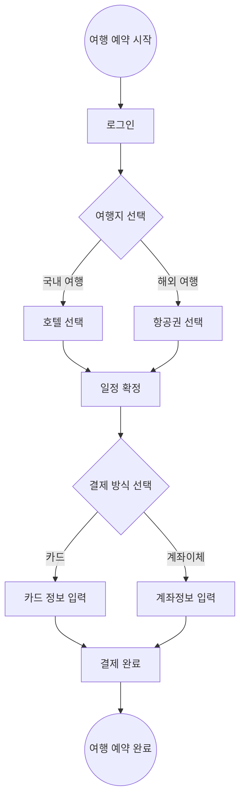
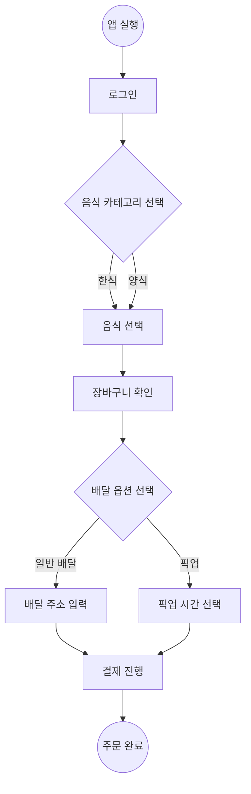
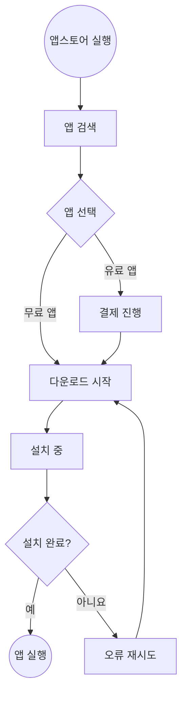

# 1. FLOW CHART

## 1.1 각 노드의 역할
[Rectangle Node] 직사각형
 - 용도 : 일반적인 프로세스나 작업 단계를 나타냄.
 - 예시 : 회원가입 처리 단계
            1. A[회원가입 요청] --> B[사용자 데이터 검증]
            2. B --> C[DB에 사용자 저장]
 ```
    A[회원가입 요청] --> B[사용자 데이터 검증]
    B --> C[DB에 사용자 저장]
 ```
 
{Diamond Node} 마름모
 - 용도 : 조건문이나 의사결정 과정을 나타냄.
 - 예시 : 로그인 API의 조건 확인 
            1. 입력 데이터 유효성 검증
```
    A[로그인 요청] --> B{입력 데이터 유효성 검증}
    B -->|유효함| C[JWT 생성 및 응답]
    B -->|유효하지 않음| D[에러 반환]
```

(This is a Circle) 둥근 직사각형
 - 용도 : 프로세스 중간의 그룹화된 작업을 나타냄.
 - 예시 : 댓글 API의 상태 처리
            1. A[댓글 작성 요청] --> B(댓글의 상태 처리) 
            2. B --> C[댓글 저장 완료]
            
([Rounded Rectangle]) 가로로 긴원
 - 용도 : 강조된 프로세스 또는 API
 - 예시 : 게시물 생성 API
            1. ([파일 업로드 처리])
 
[/Parallelogram Node/] 팽행 사변형
 - 용도 : 입력 또는 출력이 포함된 작업
 - 예시 : 회원가입에서 입력 처리
            1. A[/사용자 입력 데이터/]
 
{{Hexagon Node}} 육각형
 - 용도 : 병렬 처리나 중요한 중심 역할
 - 예시 : 추천 시스템의 병렬 처리
            1. B{{병렬 작업 시작}}
 
((Circle Node)) 원형
 - 용도 : 시작 또는 종료를 나타냄
 - 예시 : API 요청의 시작과 끝
                1. A((요청 시작)) --> B[로그인 요청]
                2. B --> C[JWT 생성]
                3. C --> D((요청 종료))
 - 
## 1.2 요약:
```
직사각형: 작업이나 단계를 표현.
마름모: 의사결정(조건).
둥근 직사각형: 중간 상태나 묶음 작업.
가로로 긴 원: 강조된 주요 작업.
평행사변형: 입력 또는 출력 단계.
육각형: 병렬 작업이나 중심 작업.
원형: 시작과 종료를 명확히 표현.
```

## 1.3 정리
```
직사각형 : task 
마름모: 검증, 사용자가 어떤 선택을 해야하는 시점
평행 사변형: input, output, 사용자의 입력
육각형: 병렬 처리 (여러 일을 함), 또는 중요한 task
원형 : 시작과 끝
// 가로로 긴원 : 강조된 task
```

## 1.4 그리기
### 1.4.1 커뮤니티 글 작성 순서도


### 1.4.2 인터넷 영화 예매 순서도


### 1.4.3 온라인 쇼핑 순서도


### 1.4.4 여행 예약 순서도

### 1.4.5 음식 배달 앱 주문 순서도


### 1.4.6 스마트폰 앱 순서도



    


