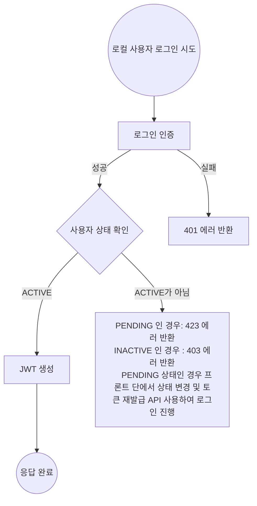
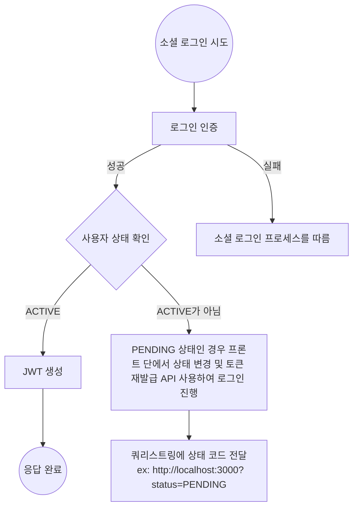
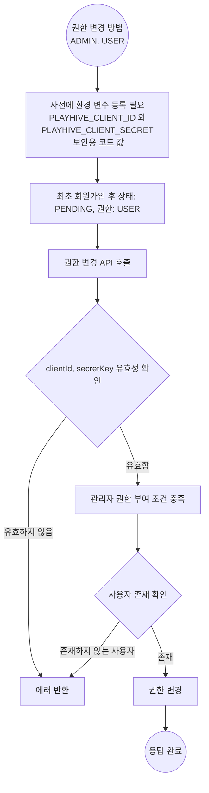

### 1. 로컬 사용자 로그인 순서도

### 2. 소셜 로그인 순서도

### 3. 계정을 관리자 권한으로 변경하고 싶은 경우

### 4. PLAYHIVE_CLIENT_ID 와 PLAYHIVE_CLIENT_SECRET 값
PLAYHIVE_CLIENT_ID: 1ZDYmrYNwVcioFZNKVQ5VSqylF
PLAYHIVE_CLIENT_SECRET: RK1j0C33CUexMs

### 5. 로그인 절차 없이 토큰 발급 방법
Swagger UI 에서 /api/members/get-token/user/{email}[GET] 해당 메서드를 사용하여 토큰 발급이 가능합니다.
해당 기능은 개발 편의 기능으로 만들어 졌습니다.
